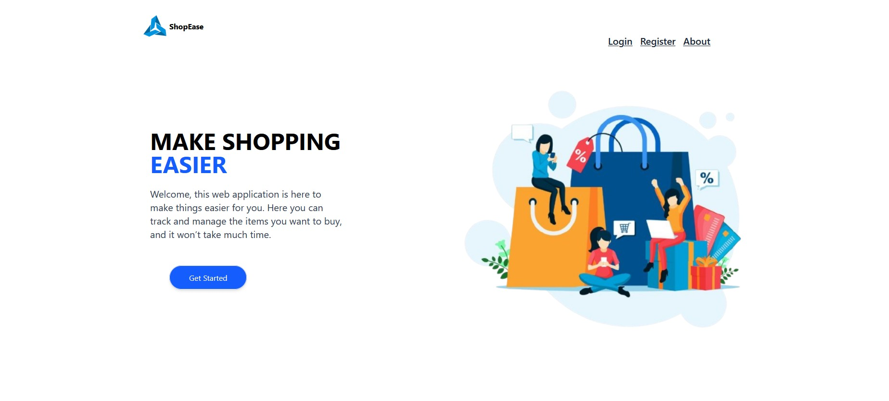
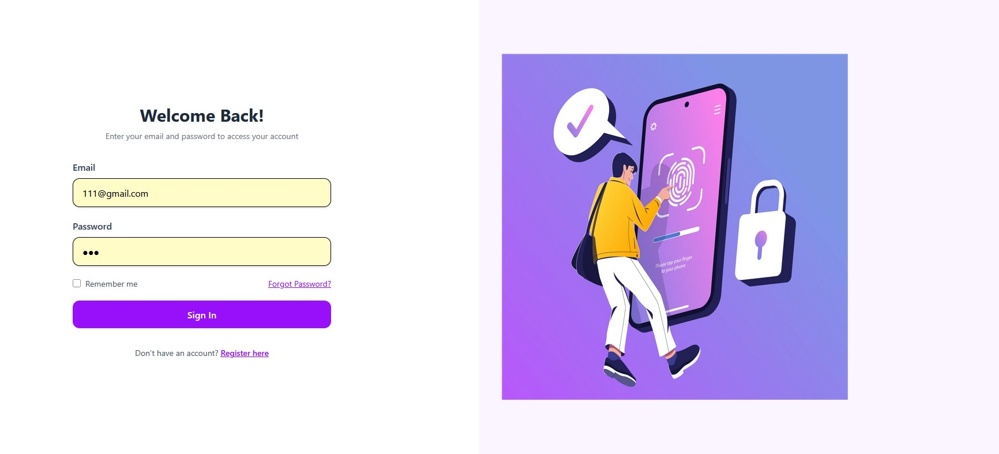

# React Redux Shopping List

A simple Shopping List web application built with React and Redux. Users can add, remove, and manage shopping items. This project demonstrates state management using Redux and a clean React component structure.

---

## Features

- Add items to your shopping list
- Remove items from the list
- Manage state globally using Redux
- Fast and responsive interface with React
- Real-time updates when items are added or removed
- Demonstrates Redux actions, reducers, and store usage

---

## Technologies Used

- React
- Redux
- React Redux
- TypeScript / JavaScript
- HTML5 & CSS3

---

## Project Structure

shopping-list/
│
├── src/
│   ├── components/
│   │   ├── ShoppingList.tsx
│   │   ├── ShoppingItem.tsx
│   │   └── AddItemForm.tsx
│   │
│   ├── redux/
│   │   ├── actions.ts
│   │   ├── reducer.ts
│   │   └── store.ts
│   │
│   ├── App.tsx
│   ├── index.tsx
│   └── styles.css
│
├── package.json
└── README.md

---

## Installation

1. Start Server

npx json-server --watch db.json --port 5006

2. Clone the repository:

git clone https://github.com/your-username/react-redux-shopping-list.git

3. Navigate into the project folder:

cd react-redux-shopping-list

4. Install dependencies:

npm install

5. Start the development server:

npm start

The app should open at:

http://localhost:3000

---

## How Redux Works in This App

1. Actions – Define the events that can change the shopping list (e.g., ADD_ITEM, REMOVE_ITEM).  
2. Reducer – Handles state updates based on dispatched actions.  
3. Store – Centralized state for the shopping list.  
4. React Components – Components use `useDispatch` to trigger actions and `useSelector` to access the state.

---

## Usage

1. Type an item in the input field.  
2. Click "Add Item" → it appears in the list.  
3. Click "Remove" → deletes the item.  

---

## Learning Goals

- Understanding Redux state management in React
- Dispatching actions and updating reducers
- Connecting React components to Redux store
- Managing form inputs and dynamic lists

---

## Future Improvements

- Edit items in the list
- Persist list to localStorage
- Improve mobile responsiveness
- Categorize shopping items

---

## Screenshots

